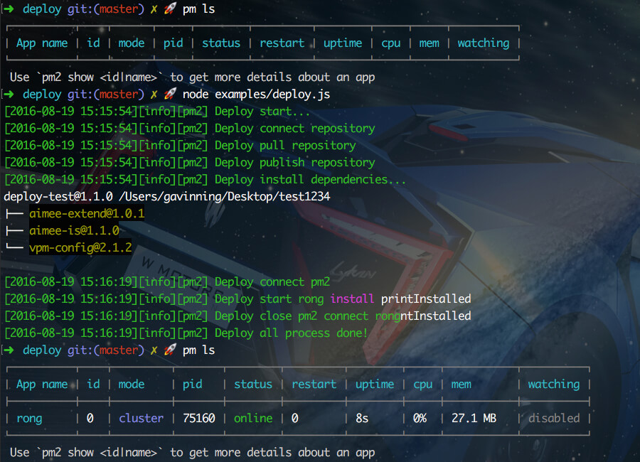

deploy
---

### Install
```sh
$ npm i aimee-deploy --save
```
```sh
$ npm i co gre --save
$ npm i pm2 -g
```

### Usage
```js
var $ = require('co');
var Gre = require('gre')
var gre = Gre.create('[:time][:title][:git] :message')
var Deploy = require('deploy');
var deploy = new Deploy({
    git: {
        // 远程Git仓库地址
        url: 'https://github.com/gavinning/deploy-test.git',
        // 本地目标地址
        target: '/Users/gavinning/Desktop/test1234'
    },
    pm: {
        // 应用名称
        name: 'test',
        // 可选，为空时自动赋值为 this.git.target
        script: '/Users/gavinning/Desktop/test1234',
        exec_mode : 'cluster',
        instances : 1,
        max_memory_restart : '100M'
    }
})
```

### Example
Publish 发布
```js
// 快捷发布方式
deploy.publish().then(function(){
    // do something
})
```
```js
// 详细发布流程
$(function *(){
    try{
        // 连接git仓库
        gre.info('Deploy start...')
        gre.info('Deploy connect repository')
        yield deploy.git.repo()

        // 更新git仓库
        gre.info('Deploy pull repository')
        yield deploy.git.pull()

        // 发布新版本
        gre.info('Deploy publish repository')
        yield deploy.git.publish()

        // 安装NPM依赖
        gre.info('Deploy install dependencies...')
        yield deploy.npm.install()

        // 连接pm2
        gre.info('Deploy connect pm2')
        yield deploy.pm.connect()

        // 启动app
        gre.info('Deploy start', deploy.config.pm.name)
        yield deploy.pm.start()

        // 关闭pm2连接
        gre.info('Deploy close pm2 connect', deploy.config.pm.name)
        deploy.pm.disconnect()

        gre.info('Deploy all process done!')
    }
    catch(e){
        console.log(e.message)
    }
})
```


### Example
Rollback 回滚
```js
// 快捷回滚方式
deploy.rollback(tagName).then(function(){
    // do something
})
```
```js
// 详细回滚流程
$(function *(){
    try{
        // 连接git仓库
        gre.info('Deploy start...')
        gre.info('Deploy connect repository')
        yield deploy.git.repo()

        // 回滚到指定版本
        gre.info('Deploy rollback repository')
        yield deploy.git.rollback(tagName)

        // 连接pm2
        gre.info('Deploy connect pm2')
        yield deploy.pm.connect()

        // 启动app
        gre.info('Deploy start', deploy.config.pm.name)
        yield deploy.pm.start()

        // 关闭pm2连接
        gre.info('Deploy close pm2 connect', deploy.config.pm.name)
        deploy.pm.disconnect()

        gre.info('Deploy all process done!')
    }
    catch(e){
        console.log(e.message)
    }
})
```

---
```sh
$ pm2 ls
```
